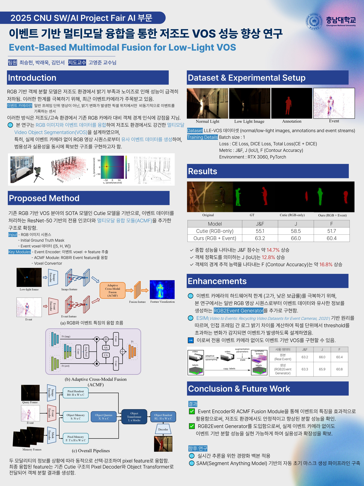

# Event-Based Multimodal Fusion for Low-Light VOS

This project proposes a novel **multimodal video object segmentation (VOS)** system for low-light environments. By combining RGB images with event-based data, we extend the CUTIE model architecture with an **Event Encoder** and a custom **Adaptive Cross-Modal Fusion (ACMF)** module. The resulting model significantly improves object segmentation performance in dark or low-contrast scenes.



---

## Key Features

- Dual-modal input: RGB frames + Event voxel grid (5 bins)
- Adaptive Cross-Modal Fusion (ACMF) for dynamic feature integration
- Significantly higher accuracy on low-light VOS benchmarks
- Built-in `RGB2Event` converter for flexible event simulation
- Lightweight prototype optimized for real-time inference

---

## Model Overview

- **Backbone**: CUTIE (Memory-based VOS framework)
- **RGB Encoder**: ResNet50
- **Event Encoder**: ResNet18 (5-channel voxel input)
- **Fusion**: ACMF module aligns and weights modality-specific features

---

## Getting Started

### 1. Installation

```bash
git clone https://github.com/your-org/LowLight-VOS.git
cd LowLight-VOS
pip install -r requirements.txt
```

### 2. Generate Event Voxels from RGB
```bash
python tools/RGB2EventConverter.py \
    --input data/RGB/ \
    --output data/Event_voxels/
```

### 3. Run Inference
```bash
python cutie/eval_vos.py model=cutie_multimodal dataset=vos_dataset
```

---

## Benchmark Results

Model	J&F	J	F
CUTIE (RGB-only)	55.1	58.5	51.7
Ours (RGB+Event)	63.2	66.0	60.4
J: Region similarity (IoU)
F: Contour accuracy
J&F: Average of J and F
The inclusion of event data leads to over +8.0 points gain in J&F score.

---

## Use Case & Applications

Night-time drone surveillance
Border and perimeter monitoring
Low-light road scene understanding
Intelligent security camera systems

---

### Dataset

LLE-VOS (Low-Light Event VOS Dataset)
RGB image sequences
Ground truth masks
Pseudo-events generated via RGB2EventConverter

---

## Future Directions

Model compression for edge devices
Integration with prompt-based segmentation (e.g., SAM)
Time-synchronized multimodal training (RGB + Event + IR)
Live-streaming UI and user testing

